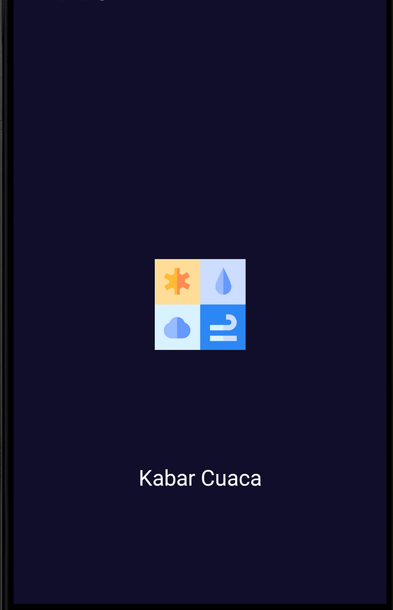
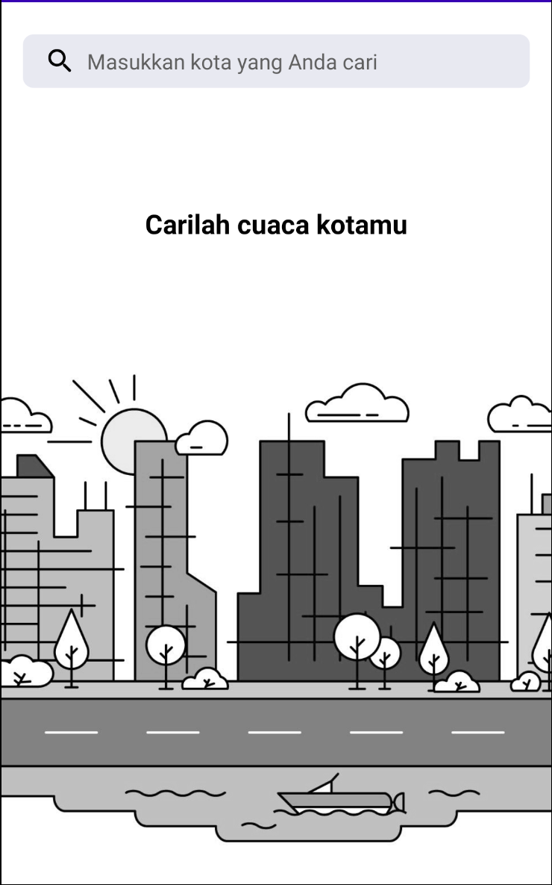
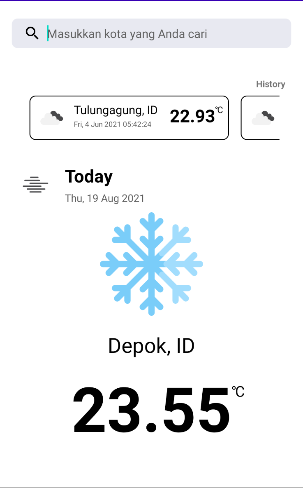
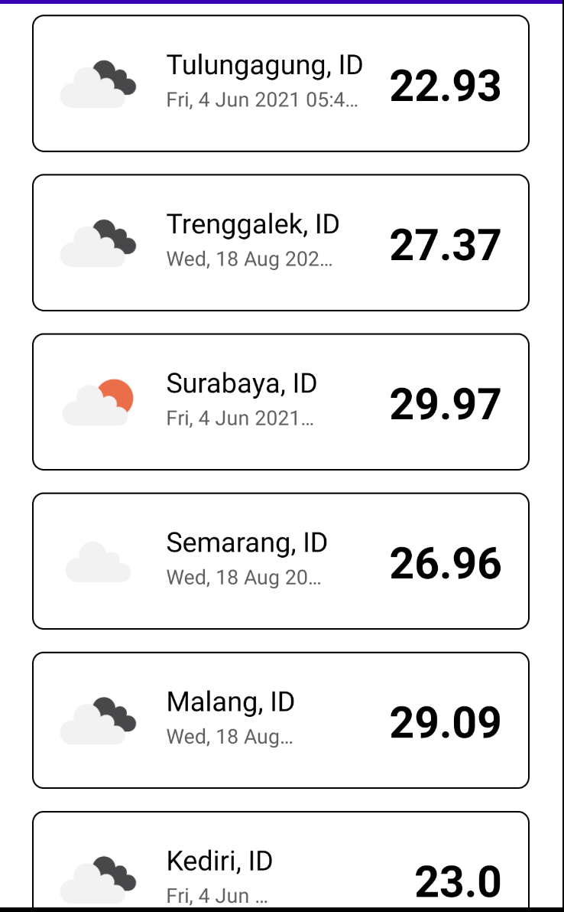

# KabarCuaca
Cari dan temukan cuaca di kota Anda

## Specs & Open-source libraries
- Minimum SDK 16
- 100% Kotlin based
- TMDB API
- MVVM Architecture
- Architecture Components (Lifecycle, LiveData, ViewModel, Room Persistence)
- Room
- Kodein dependency injection

## Documentation

### State and Activity
|Splash                 |   Home             |   Search      |   History |
|:------------------:|:----------------------------:|:---------------------:|:-----------------:|
|  |  |  |  |
